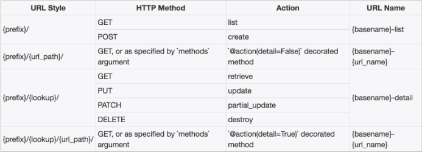
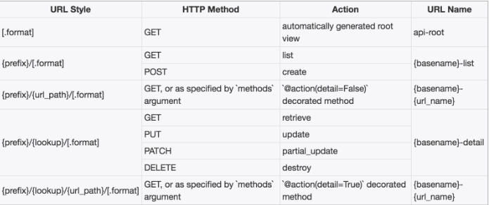

### 6~12

### 一、视图类

1. GenericAPI源码分析


|            | 属性               | 方法                                     |                                          |
| ---------- | ---------------- | -------------------------------------- | ---------------------------------------- |
| Serializer | serializer_class | get_serializer_class(self)             |                                          |
|            |                  | get_serializer(self, *args, \**kwargs) | 该方法在提供序列化器对象的时候，会向序列化器对象的context属性补充三个数据：request、format、view |
| QuerySet   | queryset         | get_queryset(self)                     |                                          |
|            |                  | get_object(self)                       | 若详情访问的模型类对象不存在，会返回404                    |


2. GenericAPIView视图相关说明


`rest_framework.generics.GenericAPIView`继承自`APIVIew`，**主要增加了操作序列化器和数据库查询的方法，作用是为下面Mixin扩展类的执行提供方法支持。通常在使用时，可搭配一个或多个Mixin扩展类。**


3. Mixin扩展类


| 类                  | 说明                                       |
| ------------------ | ---------------------------------------- |
| ListModelMixin     | `list(request, *args, **kwargs)`方法快速实现列表视图，返回200状态码 |
| CreateModelMixin   | `create(request, *args, **kwargs)`方法快速实现创建资源的视图，成功返回201状态码。 |
| RetrieveModelMixin | `retrieve(request, *args, **kwargs)`方法，可以快速实现返回一个存在的数据对象。 如果存在，返回200， 否则返回404。 |
| UpdateModelMixin   | `update(request, *args, **kwargs)`方法，可以快速实现更新一个存在的数据对象。 `partial_update(request, *args, **kwargs)`方法，可以实现局部更新。成功返回200，序列化器校验数据失败时，返回400错误 |
| DestroyModelMixin  | `destroy(request, *args, **kwargs)`方法，可以快速实现删除一个存在的数据对象。 成功返回204，不存在返回404。 |


4. 子类视图的使用


| 类                            | 继承自GenericAPIView                        | 提供方法                 |
| ---------------------------- | ---------------------------------------- | -------------------- |
| CreateAPIView                | ` CreateModelMixin`                      | post                 |
| ListAPIView                  | ``ListModelMixin``                       | get                  |
| RetrieveAPIView              | ``RetrieveModelMixin``                   | get                  |
| DestoryAPIView               | ``DestoryModelMixin``                    | put 和 patch          |
| ListCreateAPIView            | `` ListModelMixin``、``CreateModelMixin`` | list 和 create        |
| RetrieveUpdateAPIView        | ``RetrieveModelMixin``、``UpdateModelMixin`` | get、put、patch        |
| RetrieveDestroyAPIView       | `` RetrieveModelMixin``、``UpdateModelMixin`` | retrieve 和 destroy   |
| RetrieveUpdateDestoryAPIView | `` RetrieveModelMixin``、``UpdateModelMixin``、``DestoryModelMixin`` | get、put、patch、delete |

5. 视图类的继承


### 二、视图集


使用视图集ViewSet，可以将一系列逻辑相关的动作放到一个类中：

- list() 提供一组数据
- retrieve() 提供单个数据
- create() 创建数据
- update() 保存数据
- destory() 删除数据

> ViewSet视图集不再实现get和post类似的方法，以action来edit,需要在as_view里面提前设置键值对
>
> eg:`url(r'^book10/(?P<pk>\d+)/$', BookInfoViewSet.as_view({'get': 'retrieve'})`


1. ViewSet视图集的父类


继承自`APIView`与`ViewSetMixin`提供了身份认证、权限校验、流量管理等。

> **ViewSet主要通过继承ViewSetMixin来实现在调用as_view()时传入字典（如{'get':'list'}）的映射处理工作。**


2. GenericViewSet视图集父类


它帮助我们完成了这样的继承工作，继承自`GenericAPIView`与`ViewSetMixin`，在实现了调用as_view()时传入字典（如`{'get':'list'}`）的映射处理工作的同时，还提供了`GenericAPIView`提供的基础方法，可以直接搭配Mixin扩展类使用。


3. ModelViewSet视图集父类


继承自`GenericViewSet`，同时包括了ListModelMixin、RetrieveModelMixin、CreateModelMixin、UpdateModelMixin、DestoryModelMixin。

---
**ReadOnlyModelViewSet**继承自`GenericViewSet`，同时包括了ListModelMixin、RetrieveModelMixin。


4. 视图集中添加额外的action


当视图集当中的不能够满足我们的开发的时候，我们会利用`action`

````python
def latest(self, request):
        """
        返回最新的图书信息
        """
        book = BookInfo.objects.latest('id')
        serializer = self.get_serializer(book)
        return Response(serializer.data)
# ===================相应的路由注册要注意====为了却别list方法和retrieve方法的get=============
 url(r'^books/latest/$', views.BookInfoViewSet.as_view({'get': 'latest'})),
````


5. 视图集对象action的属性


在视图集中，我们可以通过action对象属性来获取当前请求视图集时的action动作是哪个。

```python
def get_serializer_class(self):
    if self.action == 'create':
        return OrderCommitSerializer
    else:
        return OrderDataSerializer
```


### 三、路由Router

在编写视图集的时候，我们可以利用程序快速实现路由信息

REST framework提供了两个router

- **SimpleRouter**
- **DefaultRouter**

1. Router的作用和SimpleRouter


```
router = routers.SimpleRouter()
router.register(r'turing', BookInfoViewSet, base_name='emmy')
```

register(prefix, viewset, base_name)

- prefix 该视图集的路由前缀
- viewset 视图集
- base_name 路由名称的前缀

路由结果为

```
^turing/$    name: emmy-list
^turing/{pk}/$   name: emmy-detail
```

> 附：添加路由有两种方式
>
> ```python
> urlpatterns = [
>     ...
> ]
> urlpatterns += router.urls
> ```
>
> 或者
>
> ```python
> urlpatterns = [
>     ...
>     url(r'^', include(router.urls))
> ]
> ```
>
> 


2. SimpleRouters生成视图集中的额外处理方法action配置


以action装饰器装饰的方法名会作为action动作名，与list、retrieve等同。

action装饰器可以接收两个参数：

- **methods**: 声明该action对应的请求方式，列表传递
- **detail**: 声明该action的路径是否与单一资源对应，及是否是`xxx//action方法名/`True 表示路径格式是`xxx//action方法名/`False 表示路径格式是`xxx/action方法名/`


3. Simplerouter的url配置项生成规则


`Simplerouter`



`Defaultrouter`



> DefaultRouter与SimpleRouter的区别是，DefaultRouter会多附带一个默认的API根视图，返回一个包含所有列表视图的超链接响应数据。


4. DefaultRouter的使用bok13/urls.py

```python
urlpatterns=[

]
router = SimpleRouter()
router.register('book13',views.BookInfoViewSet,base_name = "Book13")
urlpatterns+=router.urls
```

